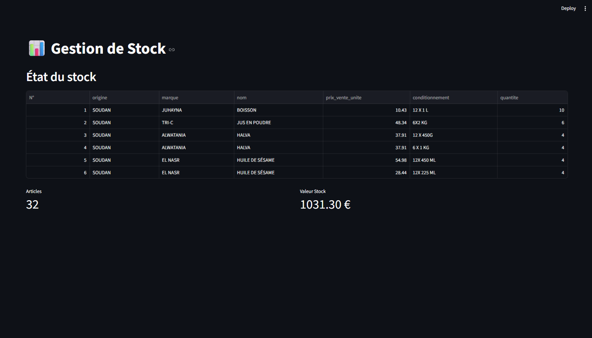
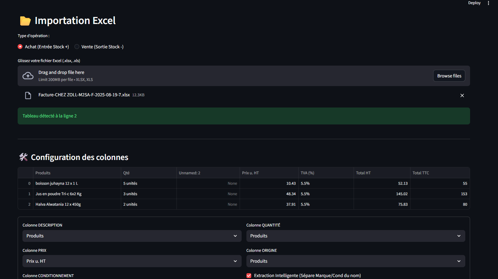

# 📦 Gestionnaire de Stock Intelligent (M2SA)

Outil d'automatisation de gestion de stocks développé pour une PME, permettant de transformer des factures fournisseurs (Excel) en une base de données structurée.

## 🚀 Fonctionnalités clés
- **Import Intelligent :** Détection automatique des en-têtes dans les fichiers Excel (Header Hunter).
- **Data Cleaning :** Extraction des marques, noms de produits et conditionnements (ex: 6x2kg) via expressions régulières (Regex).
- **Interface Intuitive :** Dashboard interactif réalisé avec **Streamlit** pour visualiser et modifier les stocks en temps réel.
- **Persistance des données :** Base de données locale **SQLite3** avec gestion de l'intégrité (Unique Constraints).

## 🛠️ Stack Technique
- **Langage :** Python 3.x
- **Data :** Pandas (Traitement de données), SQLite3 (Base de données)
- **Interface :** Streamlit

## ⚙️ Installation & Lancement
1. Exécuter `Installation.bat` pour installer les dépendances.
2. Exécuter `Lancer_Stock.bat` pour démarrer l'application.

## 📈 Impact Métier
Cet outil a permis de réduire le temps de saisie manuelle des stocks et de minimiser les erreurs d'inventaire grâce à l'automatisation du nettoyage des données factures.

## 📸 Aperçu de l'interface

*Légende : Visualisation de l'état des stocks et des indicateurs clés.*

*Légende : Module d'importation intelligente de fichiers Excel.*
